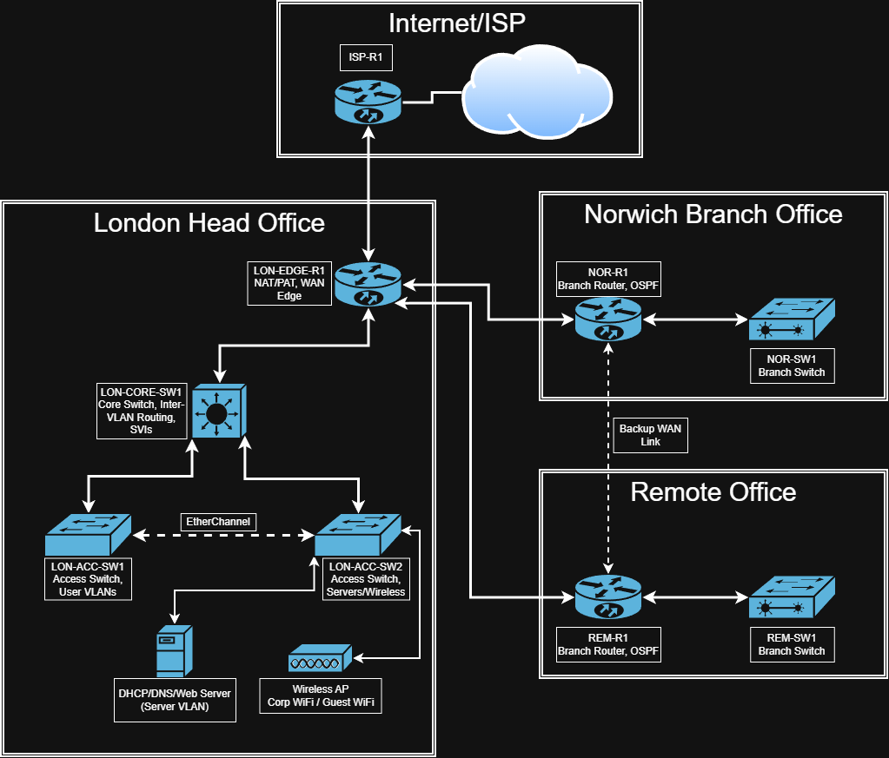

# Phase 2: Topology, IP Addressing, and VLAN Design

## Phase Objective

The objective of this phase is to define the logical network design before starting the main Cisco Packet Tracer implementation.

This phase covers the network topology, site addressing structure, VLAN allocation, subnet design, WAN link addressing, and device naming convention. The purpose is to create a clear design baseline that can be followed during the configuration phases.


## Deliverables

The deliverables for this phase are:

- Logical network topology diagram
- Site IP addressing structure
- VLAN and subnet allocation table
- WAN link addressing table
- Device naming convention
- Initial design notes for routing, switching, and management

Files for this phase:

```text
Docs/topology-ip-addressing-and-vlan-design.md
Diagrams/logical-topology.png
Diagrams/logical-topology.drawio
```


## Logical Network Topology

The network will be designed as a multi-site enterprise topology with three internal sites and one simulated external network.

| Site | Role |
|---|---|
| London Head Office | Main site, core switching, servers, management, and internet breakout |
| Norwich Branch Office | Branch site connected to London over WAN |
| Remote Office | Smaller remote site with limited local infrastructure |
| ISP / Internet | Simulated external network for internet access testing |

The London Head Office will act as the primary site. It will host the main server VLAN, DHCP/DNS simulation, network management, and NAT/PAT internet breakout.

Norwich and the Remote Office will connect back to the London site using point-to-point WAN links. OSPF will be used in a later phase to dynamically exchange routes between sites.


## High-Level Topology Diagram

The logical topology will follow this structure:




An optional backup WAN link may be added between Norwich and the Remote Office later in the project.


## Site Addressing Structure

Each site will use a dedicated private IP range. This keeps the design structured, scalable, and easier to troubleshoot.

| Site | Address Range | Purpose |
|---|---|---|
| London Head Office | `10.10.0.0/16` | Main office networks |
| Norwich Branch Office | `10.20.0.0/16` | Branch office networks |
| Remote Office | `10.30.0.0/16` | Remote office networks |
| WAN Links | `172.16.0.0/24` | Point-to-point router links |
| Simulated Internet | `203.0.113.0/24` | External/public test network |

Each internal VLAN will use a `/24` subnet. This keeps the addressing simple and readable.


## VLAN Design

The project will use consistent VLAN IDs across the enterprise where possible.

| VLAN ID | VLAN Name | Purpose |
|---:|---|---|
| 10 | IT | IT users and administrative access |
| 20 | HR | HR department users |
| 30 | Finance | Finance department users |
| 40 | Operations | Operations users |
| 50 | Servers | Internal services |
| 60 | Guest | Guest internet-only access |
| 99 | Management | Router and switch management |

Not every site needs every VLAN. Smaller sites may only use the VLANs required for their local users.


## London Head Office VLAN Subnets

London is the main site and will contain the full VLAN structure.

| VLAN | Name | Subnet | Default Gateway |
|---:|---|---|---|
| 10 | IT | `10.10.10.0/24` | `10.10.10.1` |
| 20 | HR | `10.10.20.0/24` | `10.10.20.1` |
| 30 | Finance | `10.10.30.0/24` | `10.10.30.1` |
| 40 | Operations | `10.10.40.0/24` | `10.10.40.1` |
| 50 | Servers | `10.10.50.0/24` | `10.10.50.1` |
| 60 | Guest | `10.10.60.0/24` | `10.10.60.1` |
| 99 | Management | `10.10.99.0/24` | `10.10.99.1` |


## Norwich Branch VLAN Subnets

Norwich will use the same VLAN ID structure but with the `10.20.0.0/16` site range.

| VLAN | Name | Subnet | Default Gateway |
|---:|---|---|---|
| 10 | IT | `10.20.10.0/24` | `10.20.10.1` |
| 20 | HR | `10.20.20.0/24` | `10.20.20.1` |
| 30 | Finance | `10.20.30.0/24` | `10.20.30.1` |
| 40 | Operations | `10.20.40.0/24` | `10.20.40.1` |
| 60 | Guest | `10.20.60.0/24` | `10.20.60.1` |
| 99 | Management | `10.20.99.0/24` | `10.20.99.1` |

Norwich will not host the main Server VLAN in the initial design. Server services will be centralised in London.


## Remote Office VLAN Subnets

The Remote Office will use a smaller VLAN structure.

| VLAN | Name | Subnet | Default Gateway |
|---:|---|---|---|
| 10 | IT | `10.30.10.0/24` | `10.30.10.1` |
| 40 | Operations | `10.30.40.0/24` | `10.30.40.1` |
| 60 | Guest | `10.30.60.0/24` | `10.30.60.1` |
| 99 | Management | `10.30.99.0/24` | `10.30.99.1` |

The Remote Office is intentionally smaller to reflect a realistic lightweight branch network.


## WAN Link Addressing

Point-to-point WAN links will use `/30` subnets from the `172.16.0.0/24` range.

| Link | Subnet | Device A | Device B |
|---|---|---|---|
| London to Norwich | `172.16.0.0/30` | `172.16.0.1` | `172.16.0.2` |
| London to Remote Office | `172.16.0.4/30` | `172.16.0.5` | `172.16.0.6` |
| Norwich to Remote Office Optional Backup | `172.16.0.8/30` | `172.16.0.9` | `172.16.0.10` |
| London Edge to ISP | `203.0.113.0/30` | `203.0.113.2` | `203.0.113.1` |

The optional Norwich-to-Remote link may be added later to demonstrate backup routing or routing redundancy.


## Device Naming Convention

Devices will use a clear location-role-number naming format.

Format:

```text
<SITE>-<ROLE>-<NUMBER>
```

Examples:

| Device Name | Description |
|---|---|
| `LON-EDGE-R1` | London edge router |
| `LON-CORE-SW1` | London Layer 3 core switch |
| `LON-ACC-SW1` | London access switch 1 |
| `LON-ACC-SW2` | London access switch 2 |
| `NOR-R1` | Norwich router |
| `NOR-SW1` | Norwich access switch |
| `REM-R1` | Remote Office router |
| `REM-SW1` | Remote Office switch |
| `ISP-R1` | Simulated ISP router |

This naming convention makes the topology easier to understand, document, and troubleshoot.


## Design Decisions

### Centralised Services

Core services such as DHCP, DNS simulation, and internal web services will be hosted in the London Server VLAN. This reflects a common enterprise design where branch sites consume central services over the WAN.

### Consistent VLAN IDs

The same VLAN IDs are reused across sites where possible. This improves consistency and makes the design easier to understand.

### Site-Based IP Ranges

Each site uses a different `/16` range. This makes route identification, summarisation, and troubleshooting easier.

### `/24` VLAN Subnets

Each VLAN uses a `/24` subnet for simplicity. This is suitable for a CCNA-level project and keeps addressing readable.

### `/30` WAN Subnets

WAN point-to-point links use `/30` subnets to demonstrate efficient address usage.

### London Internet Breakout

Internet access will break out through the London Edge Router using NAT/PAT in a later phase.


## Design Validation Checklist

This phase will be considered complete when the following items are ready:

- Logical topology diagram created
- Site address ranges defined
- VLAN IDs defined
- VLAN subnet tables completed
- WAN addressing table completed
- Device naming convention documented
- Diagram added to the GitHub repository
- Design is ready for Packet Tracer implementation


## Next Phase

**Phase 3: Switching, VLANs, Trunking, and Inter-VLAN Routing**

The next phase will focus on implementing the LAN switching foundation in Cisco Packet Tracer, including VLAN creation, access ports, trunk links, and inter-VLAN routing.
